# STAR WARS BATTLEFRONT (2004) – PS2 ULTIMATE EDITION MOD

**Game:** Star Wars Battlefront I (2004, Pandemic Studios) – PlayStation 2  
**Platform:** PlayStation 2 (tested with PCSX2)  
**Release:** Alpha / Test Build (still contains issues/bugs)  
**Recommended Mode:** Instant Action (other modes untested)

---

## 1. Overview

This mod replaces and tweaks game files of the **PlayStation 2** version of **Star Wars Battlefront (2004)**.

Installation is intentionally simple: copy the contents of the mod folder into an extracted original PS2 ISO directory, overwrite the original files, and then rebuild the ISO.

This mod is a combination of existing community mod content plus additional fixes and adjustments.

See **Section 8: Credits / Attribution** for more information.

---

## Previews

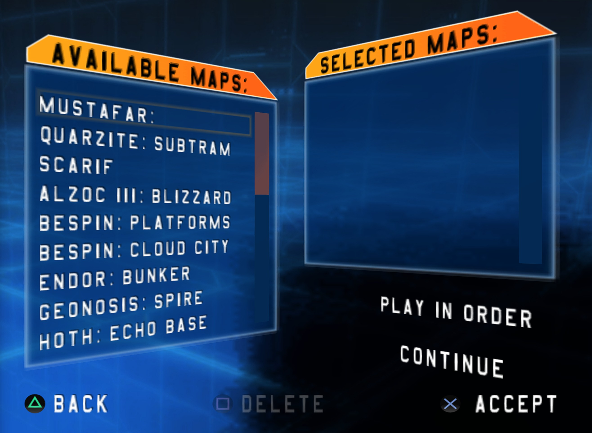
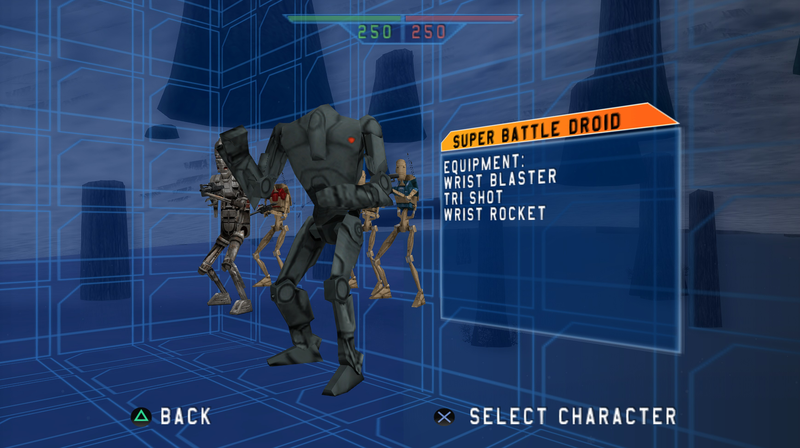
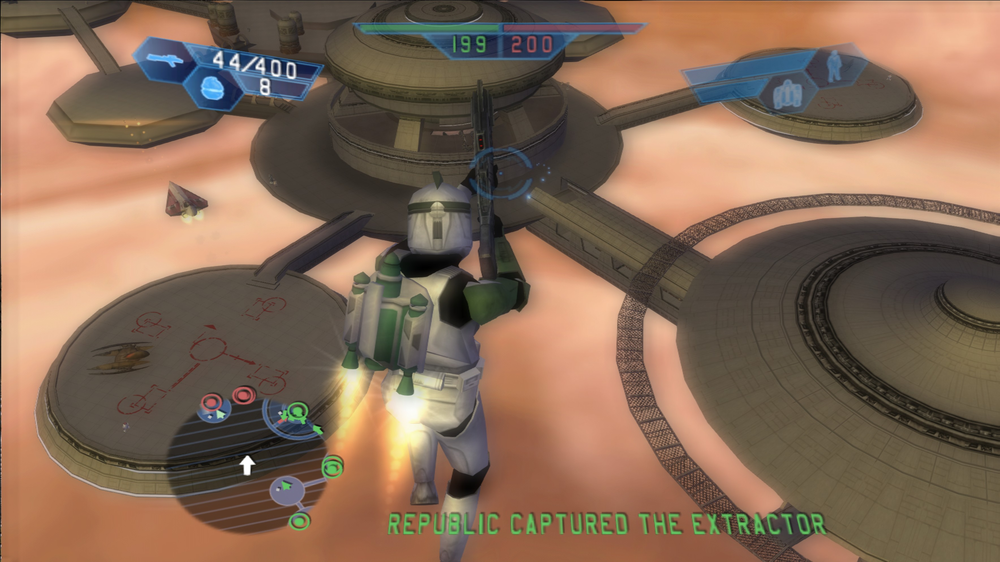

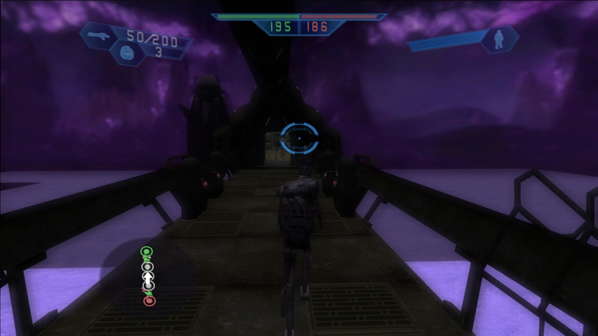
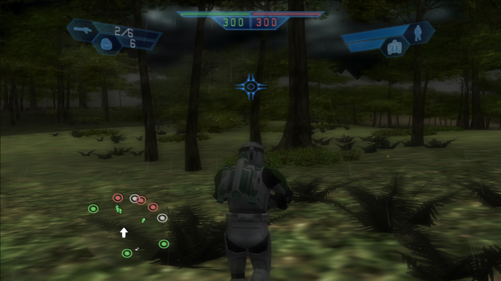
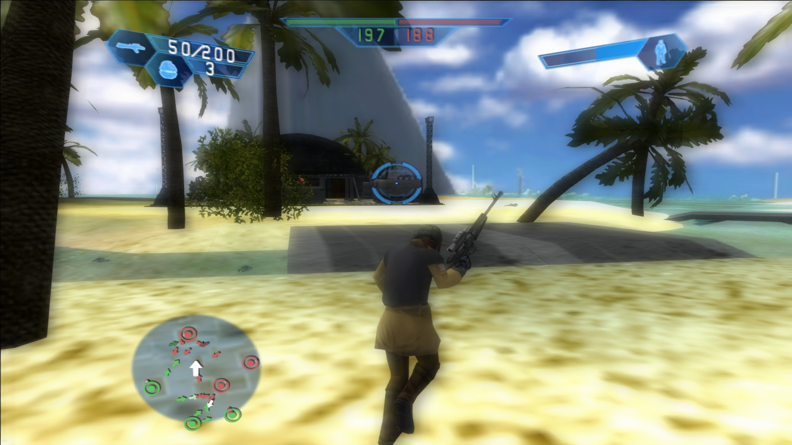
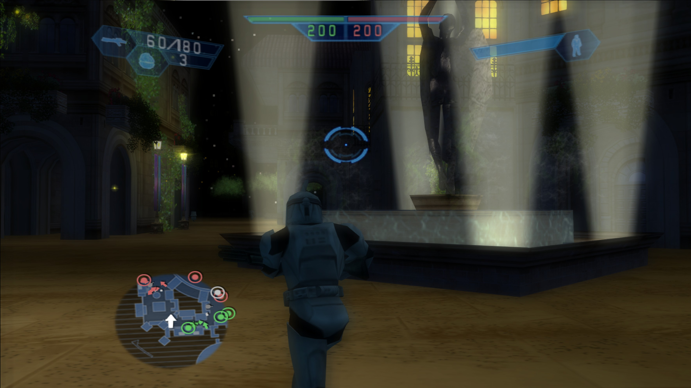
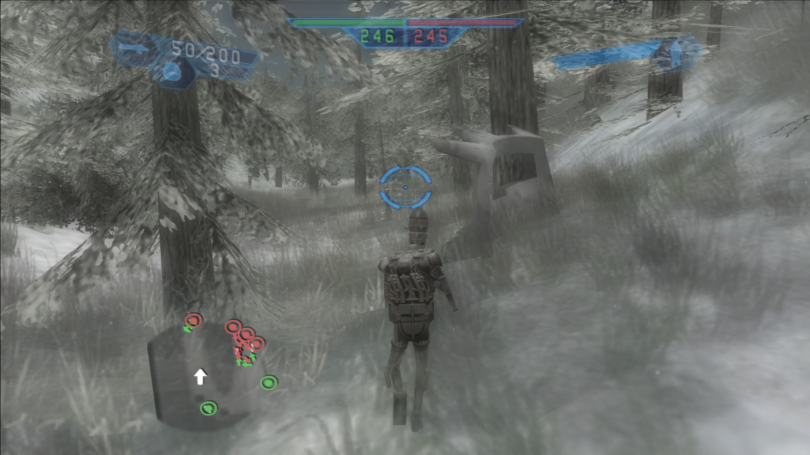
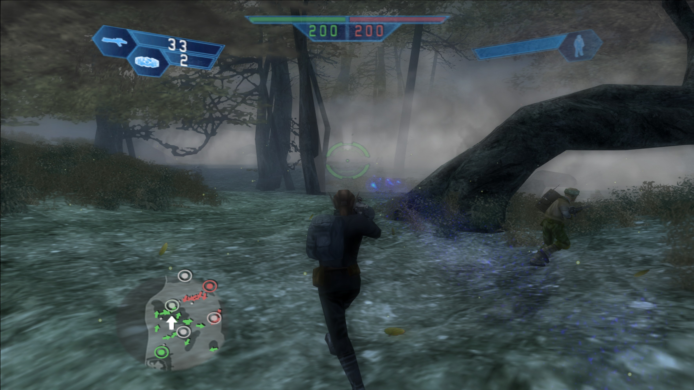
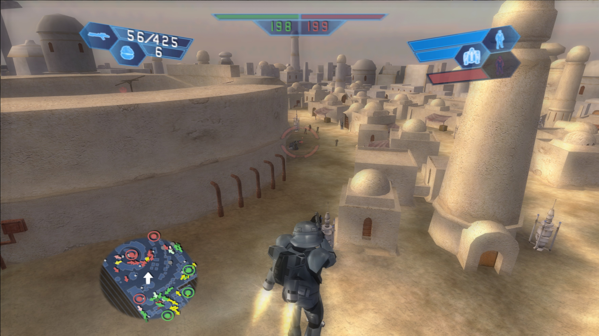
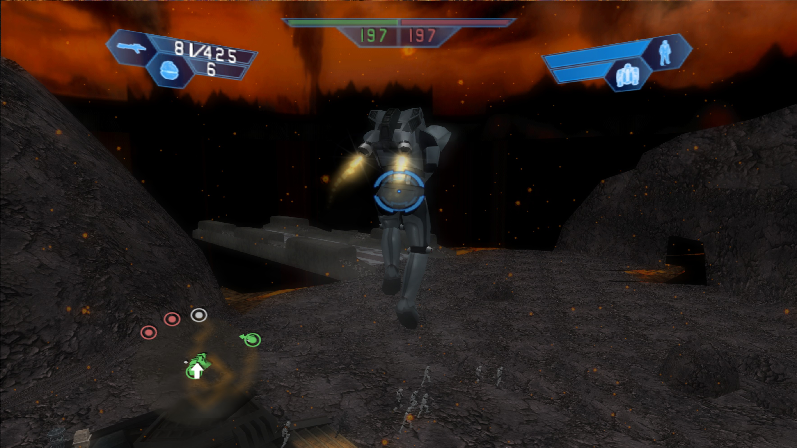
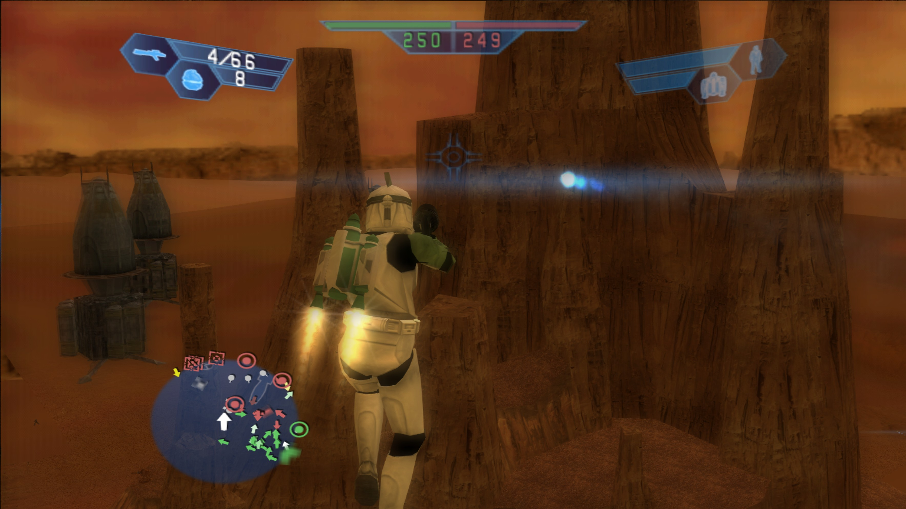
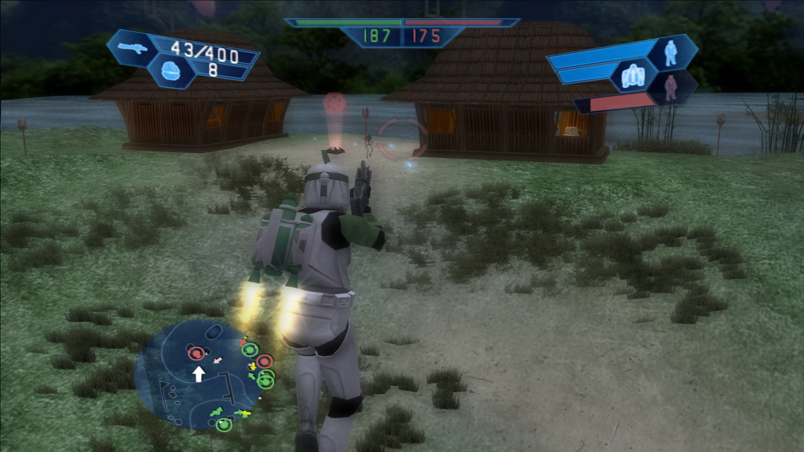

---

## 2. Requirements

- Your own original PS2 game ISO (dumped from your own disc)  
  - Tested with **SLUS-20989**, but other versions may also work
- A tool to extract the ISO contents  
  - Example: **7-Zip** or **WinRAR**
- A tool to rebuild an ISO from folders/files  
  - Example: **ImgBurn** (`Build Mode` / `Create image file from files/folders`)

### Optional

- **PCSX2** emulator
- Real PlayStation 2 hardware (using your preferred loading method)

---

## 3. Installation Guide

### A. Extract the Original ISO

1. Create a working folder, for example:

   ```text
   C:\SWBF1_PS2_MOD\
   ```

2. Right-click your original ISO and extract it with **7-Zip** or **WinRAR**.
3. You should now have the full disc structure as folders and files  
   (for example `SYSTEM.CNF` and other game directories).

### B. Copy the Mod Files

1. Open the downloaded mod folder. Inside it, you will find the `DATA` folder.
2. Copy **all folders and files** from:

   ```text
   DATA\
   ```

   into the corresponding location inside your extracted ISO directory:

   ```text
   DATA\
   ```

3. When your file manager asks whether to replace or overwrite files, choose **Yes**.

### Notes

- The goal is to overwrite the original PS2 game files with the modded ones.
- Do **not** rename files or folders.
- Only replace existing files where applicable.

### C. Rebuild the ISO (ImgBurn)

1. Open **ImgBurn**.
2. Select **Create image file from files/folders** (`Build mode`).
3. Under **Source**, select the folder containing your extracted and now modded disc files.
4. Under **Destination**, choose the output path and ISO name, for example:

   ```text
   SWBF1_PS2_MOD.iso
   ```

5. Start the build process to generate a new bootable ISO.
6. Enjoy.

### Optional

- If possible, keep the original disc label / volume label unchanged.

---

## 4. Status: Alpha / Known Issues

This is a test / alpha version and still contains issues. Known problems include:

- On some maps, vehicles and/or units may be missing or removed  
  (often due to PS2 memory limitations)
- Visual / renderer issues
  - Invisible 3D models and elements
  - Missing or broken map objects / effects
- Main menu graphics display issues
- UI / HUD issues in-game
  - Blackscreen-related missing elements
- Performance problems on some maps  
  - Slowdowns / FPS drops

---

## 5. New / Modified Maps (Highlights)

This mod includes maps that were not available in the original **SWBF1 PS2** release.

- **Mustafar** (modified) – currently has visual issues / invisible meshes
- **Quarzite Subtram** – occasional FPS drops / performance issues
- **Scarif** – bloom issue
- **Naboo by Night** – ported from *Star Wars Battlefront II*
- **Dagobah Swamp** – ported from *Star Wars Battlefront II*
- **Haruun Kal** – currently **GCW only**

---

## 6. New Units / Sides

Includes new units for all sides:

- **REP**
- **IMP**
- **CIS**
- **ALL**

---

## 7. Quality of Life / Gameplay Changes

Various gameplay tweaks and improvements, including:

- More dynamic and responsive **Jet Trooper** jetpack behavior
- Some units use different weapons
- Adjusted limits (depending on unit/setup)
- Increased energy and ammo (depending on unit/vehicle setup)
- Increased movement speed for most units and vehicles  
  - Important because **SWBF1** does not include sprinting
- Many more gameplay adjustments not listed individually here

---

## 8. Credits / Attribution

**Important:** Not all work in this mod was created by me.

This project is based on content and components released over the years from various mods and the work of the following modders:

- AnthonyBF2
- BK2Modder
- iamashaymin / iamastupid
- Additional community contributors

This mod also uses tools from **BadAL**, such as **LVLtool** and the **AltAddOn system**.

Among other things, various build tools were also used from:

- Dark_Phantom
- Delta-77
- Psych0fred
- BattleBelk
- Phobos

And of course:

- **Pandemic Studios**
- **LucasArts**

Thank you for your work for the community.
These mods have kept Battlefront players happy for years.
This community is true love for the franchise.

### My Contribution

- Making this mod reasonably playable on PS2 by patching and stabilizing it
- New tweaks, balancing, and quality-of-life changes
- Additional performance improvements on some maps / sides / ODFs / scripts
- Fixing several crashes and crash-causing issues
- Modified new **Ultimate Edition** cover art

---

## 9. ModDB / GitHub Release / Community Note / Anti-Piracy

I am releasing these mod files on **ModDB** and **GitHub** so others can more easily enjoy a **Star Wars Battlefront (2004) PS2 mod** on real hardware or in emulators.

Installation is straightforward as long as you use your own dumped **PS2 Battlefront ISO** from your own original disc.

### Important

- I explicitly distance myself from any form of software piracy.
- No game ISOs are provided.
- Only the necessary modified files of the modded content are included.
- This is a community mod, from the community, for the community, and it requires an original copy of the game.

---

## Build / Compilation Date

**21.12.2025**
